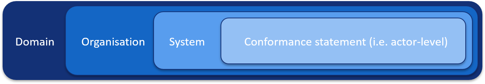

.. index:: Expressions
.. _test-case-expressions:

Expressions
-----------

Expressions are used in GITB TDL to perform arbitrary operations on context variables and to provide more control over the input and
output of specific steps. The expression language assumed by GITB TDL is **XPath 3.0** given that processing XML constructs is one of the more
frequent needs when conformance testing for content specifications. However, the use of XPath does not restrict us to using XML documents as variables; 
XPath provides sufficient expressiveness to define most operation you would need to support (albeit not always in the most intuitive way).

The following ``assign`` operations illustrate some interesting examples:

.. code-block:: xml

    <!-- 
        Assign text to a string variable.
    -->
    <assign to="myString">"aText"</assign>
    <!-- 
        Assign a number to a number variable.
    -->
    <assign to="myNumber">1</assign>
    <!--
        Assign a value to a boolean variable. Considering the assign step's content is an XPath expression, this would
        be achieved using the true() or false() functions.
    -->
    <assign to="myBoolean">true()</assign>
    <!--
        From an object variable fileContent (i.e. an XML document), extract part matching 
        /testcase/steps into another object variable named targetElement.
    -->
    <assign to="targetElement" source="$fileContent">/*[local-name() = 'testcase']/*[local-name() = 'steps']</assign>
    <!-- 
        From an object variable fooContent (i.e. an XML document), extract part matching 
        /ns1:foo/ns2:bar into another object variable named barElement. Using "ns1" and "ns2" in the 
        expression assumes they are defined in the test case's "namespaces" section.
    -->
    <assign to="barElement" source="$fooContent">/ns1:foo/ns2:bar</assign>
    <!-- 
        Assign to a number variable named result the result of adding 1 to another number 
        variable named counter.
    -->
    <assign to="result">$counter + 1</assign>
    <!-- 
        Create a custom XML fragment from a string variable named value and assign it to 
        the tempXml string variable
    -->
    <assign to="tempXml"><![CDATA['<temp>' || $value || '</temp>']]></assign>
    <!--
        Assign to the boolean result variable the result of checking that a string variable 
        named input has at least 10 characters (expression wrapped in CDATA block to use '>' 
        character without escaping it
    -->
    <assign to="result"><![CDATA[string-length($input) >= 10]]></assign>
    <!-- 
        Assign to string variable result the value "result1" if the number var is 1, or 
        "result2" otherwise
    -->
    <assign to="result">if ($var = 1) then "result1" else "result2"</assign>
    <!--
        Create a map with two entries set to strings.
    -->
    <assign to="myMap{key1}">"Value 1"</assign>
    <assign to="myMap{key2}">"Value 2"</assign>
    <!--
        Create a list with two strings (note the use of 'append').
    -->
    <assign to="myList" append="true">"Value 1"</assign>
    <assign to="myList" append="true">"Value 2"</assign>
    <!-- 
        Create a map containing another map and a list.
    -->
    <assign to="myMap{myInnerMap}{value1}">"Value 1"</assign>
    <assign to="myMap{myInnerMap}{value2}">"Value 2"</assign>
    <assign to="myMap{myInnerList}" append="true">"Value 1"</assign>
    <assign to="myMap{myInnerList}" append="true">"Value 2"</assign>

As you can see the expressions you can use are limited only to the functions available in XPath 3.0. Using these there is typically always 
a way to express what is needed, potentially by first wrapping one or more values in a custom XML wrapper and then using XPath functions
on that:

.. code-block:: xml

    <!-- 
        Store custom text content as an XML object in the string tempXml.
    -->
    <assign to="tempXml" type="object"><![CDATA['<toc>' || $toc{tocEntries} || '</toc>']]></assign>
    <!-- 
        Use object tempXml to evaluate an XPath expression and store the result in a boolean result.
    -->
    <assign to="result" source="$tempXml">contains(/toc/text(), 'file.xml')</assign>

In the above example, we are using the value contained in a ``map`` variable named "toc" to construct a temporary XML content.
We can then use the "tempXml" variable for any XPath manipulation that requires a source document.

When manipulating XML content through expressions we most likely want to use **namespaces** to ensure we correctly identify our target elements.
To directly use namespaces in XPath expressions via their declared prefixes we need to first define them in the test case's :ref:`namespaces section<test-case-namespaces>`.

Escaping XML in expressions
~~~~~~~~~~~~~~~~~~~~~~~~~~~

You need to always keep in mind that when you are writing an expression you are doing so within an XML document (the test case's). This means that
special characters such as ``<`` and ``>`` need to be escaped. There are two ways to handle this, matching how you would do this 
in any XML document.

**Approach 1: Escape entities**

Special XML characters can always be escaped using their corresponding entities. In the following example we use the ``&gt;``
entity to escape the ``>`` character:

.. code-block:: xml

    <assign to="result">string-length($input) &gt;= 10</assign>

A similar approach can be taken to replace any other special character such as ``"`` (replaced by ``&quot;``) or ``'``
(replaced by ``&apos;``).

**Approach 2: CDATA block**

Using XML escape entities can result in expressions that are hard to read. In addition, they are insufficient when the text we
are using in the expression is unknown and may give unexpected results. In these cases you can use a ``CDATA`` block:

.. code-block:: xml

    <assign to="result"><![CDATA[string-length($input) >= 10]]></assign>

.. _test-case-referring-to-variables:

Referring to variables
~~~~~~~~~~~~~~~~~~~~~~

As you have seen in the previous examples, referring to variables is a very common use case in GITB TDL expressions. Variable
references are done as ``$VARIABLE``, i.e. using the ``$`` character, followed by the variable's name. Furthermore, when
an expression consists only of a variable reference without other XPath elements it is referred to as a **pure variable reference**.
As we have discussed in :ref:`test-case-types-type-conversions`, pure variable references are important when we need to convert 
variables from one type to another in ``assign`` steps.

.. _test-case-referring-to-variables_map:

Map elements
++++++++++++

Variables of type ``map`` represent special cases as they can contain additional variables and even additional ``map`` s. Referring to 
``map`` variables themselves is done as with any other variable (i.e. ``$myMap``), but referring to entries in the ``map`` are done
by specifying the key in curly brackets (i.e. ``$myMap{myKey}``). In the case a ``map`` contains a nested ``map`` its inner values
can be referenced by appending to the expression an additional set of curly braces with the inner ``map``'s key. There is no limit to 
the nesting that is possible in a ``map``. In addition note that when specifying the keys you may also use variable references
if the key is to be determined dynamically.

Assigning values to a ``map`` variable is achieved using the ``assign`` step (see :ref:`tdl-step-assign`) or as part of the variable's 
declaration in the test case (see :ref:`test-case-variables`). Using this we can either assign values to the ``map``
itself (i.e. point it to another ``map``) or one of its keys. Moreover, assignment to a ``map`` key may be done to an existing 
entry or by defining a new one. Note that when assigning a new ``map`` entry you also need to specify the ``type`` of this entry.
The following examples illustrate ``assign`` steps that showcase the possible assignment and reference scenarios:

.. code-block:: xml

    <!-- 
        Assign map "myMap" to another map named "anotherMap". 
    -->
    <assign to="myMap">$anotherMap</assign>
    <!-- 
        Assign the entry of "myMap" named "myKey" to the string "A value". 
    -->
    <assign to="myMap{myKey}" type="string">"A value"</assign>
    <!-- 
        Assign the entry of "myMap" named "myOtherKey" to an entry of "anotherMap" 
        named "anotherKey" as a string. 
    -->
    <assign to="myMap{myOtherKey}" type="string">$anotherMap{anotherKey}</assign>
    <!-- 
        Assign value "key1" to the string variable "k1". 
        Then use the "k1" variable to pick the target entry of "myMap" 
        to set as the string "A value".
    -->
    <assign to="k1">"key1"</assign>
    <assign to="myMap{k1}" type="string">"A value"</assign>
    <!-- 
        Assign value "key1" to the string variable "k1". 
        Assign value "key2" to the string variable "k2". 
        Then use the "k1" variable to pick the target entry of "myMap" to set as a string matching 
        the entry of "anotherMap" for the key matching the value of "k2".
    -->
    <assign to="k1">"key1"</assign>
    <assign to="k2">"key2"</assign>
    <assign to="myMap{k1}" type="string">$anotherMap{$k2}</assign>
    <!-- 
        Assume that "myMap" is a map that contains a nested map named "myNestedMap" that itself 
        contains a nested map named "myFurtherNestedMap". Set key "myKey" of "myFurtherNestedMap"
        a the string "A value".
    -->
    <assign to="myMap{myNestedMap}{myFurtherNestedMap}{myKey}" type="string">"A value"</assign>

.. _test-case-referring-to-variables_list:

List variable elements
++++++++++++++++++++++

Variables of type ``list`` contain a sequence of elements of a specific type. Given that their type is defined when they are declared
(see :ref:`test-case-variables`) you don't need to specify the ``type`` attribute when assigning values to them (in ``assign`` steps). Referencing a ``list``
element is done using its index which is 0-based. Adding values to a ``list`` is achieved using the ``assign`` step and can either
target an existing list element (identified by its index) or be appended to the list. The following examples illustrate how you can reference
and assign list values:

.. code-block:: xml

    <!-- 
        Assign list "myList" to another list named "anotherList". 
    -->
    <assign to="myList">$anotherList</assign>
    <!--
        Append an item to "myList" (declared as a list of strings). 
    -->
    <assign to="myList" append="true">"Value 1"</assign>
    <!-- 
        Append another item to "myList". 
    -->
    <assign to="myList" append="true">"Value 2"</assign>
    <!-- 
        Replace the first item of "myList" with "Value 3". 
    -->
    <assign to="myList{0}">"Value 3"</assign>
    <!-- 
        Assign to the number variables "index1" and "index2" values 1 and 2 respectivelly.
        Replace the item matching "index1" of "myList" with the item matching "index2" of "anotherList".
    -->
    <assign to="index1">1</assign>
    <assign to="index2">2</assign>
    <assign to="myList{$index1}">$anotherList{$index2}</assign>

.. _test-case-referring-to-variables_missing:

Missing variables
+++++++++++++++++

During a test session is it possible that you refer to a variable that is not defined. Doing so is not always an error
given that variables may be contributed to the session via external configuration or data received from messaging, processing
or validation steps. When an expression refers to a missing variable, the value that is assigned is an **empty string**.

A typical scenario where you may want to use this is when you check configuration or data for certain input and, if missing,
set a default value through the test case. This is illustrated in the following test case snippet:

.. code-block:: xml

    <if desc="Determine validation type">
        <!-- If "$SYSTEM{validationType}" cannot be determined it is considered as being an empty string. -->
        <cond>string-length($SYSTEM{validationType}) = 0</cond>
        <then>
            <!-- No value found - set a default. -->
            <assign to="typeToUse">'defaultValidationType'</assign>
        </then>
        <else>
            <!-- Value found - use it. -->
            <assign to="typeToUse">$SYSTEM{validationType}</assign>
        </else>
    </if>
    <log>'Using validation type: ' || $typeToUse</log>

.. _test-case-variables-from-expression-output:

Defining variables from expressions
~~~~~~~~~~~~~~~~~~~~~~~~~~~~~~~~~~~

When using :ref:`assign<tdl-step-assign>` steps the goal is to use an expression to produce an output value. This value
will be stored as a variable in the test session context and used in subsequent steps. The variables to hold such values 
can either be predetermined in the test case's :ref:`variables<test-case-variables>` section, or can be defined dynamically
during the test session execution. In the latter case, the type of the variable is determined from the output of the
expression.

As examples consider the following cases, where determining the output of expressions result in corresponding variables:

.. code-block:: xml

    <!-- 
        This results in a variable of type number named "result1".
    -->
    <assign to="result1"><![CDATA[string-length($input)]]></assign>
    <!-- 
        This results in a variable of type string named "result2".
    -->
    <assign to="result2">'This is a text value'</assign>

Automatic creation of variables also applies for container types (``map`` and ``list``) based on the target variable
expressions and additional TDL constructs that are used:

.. code-block:: xml

    <!-- 
        In this case the expression's result is a number, however the expression provided in the 
        assign step's "to" indicates that this is the value "aKey" of a map named "result3". Both the
        key and the map will be automatically created if not already defined.
    -->
    <assign to="result3{aKey}"><![CDATA[string-length($input)]]></assign>
    <!-- 
        In this case the expression results in a string that will be stored in a list named "result4".
        The fact that this is a list is determined from the "append" attribute that is used to signal that
        the value is to be added to a list. If the "result4" list is missing it will be created as a result
        of this step.
    -->
    <assign to="result4" append="true">'This is a text value'</assign>

.. _test-case-configuration:

Referring to configuration parameters
~~~~~~~~~~~~~~~~~~~~~~~~~~~~~~~~~~~~~

Test cases can leverage externally provided configuration parameters as part of the test session scope. Doing so 
adds a level of customisation and parameterisation that can accommodate various external input at different levels.
Such input is typically provided by testers but can also be supplied by administrators or externally scripted
tooling.

GITB TDL, as implemented in the GITB test bed software, offers four levels of such configuration, with a 
progressively narrower scope to address all potential needs:

The following table provides a summary overview of the available configuration levels.

.. csv-table::
    :header: "Level", "Description", "Provided by", "Map variable name", "Predefined map entries"
    :stub-columns: 1
    :delim: |

    :ref:`Domain<test-case-expressions-domain>`| Relates to a complete domain and applies to any and all test cases. Such values are typically treated as high-level constant configuration values to ensure portable test cases. | Administrators.| ``DOMAIN`` | 
    :ref:`Organisation<test-case-expressions-organisation>`| Relates to an organisation as a whole and applies to all its systems and their conformance statements. | Users and administrators.| ``ORGANISATION`` | ``shortName``, ``fullName``
    :ref:`System<test-case-expressions-system>`| Relates to a system as a whole and applies to all test cases defined for it in its linked conformance statements. | Users and administrators.| ``SYSTEM`` | ``shortName``, ``fullName``, ``version``
    :ref:`Actor<test-case-expressions-actor>`| Relates to a specific conformance statement, i.e. a specific system testing as an actor of a selected specification. This is most fine-grained level of configuration.| Users and administrators. |  | 

The type of value defined by each parameter, regardless of its level, can be:

    * Simple texts as ``string`` values.
    * Secret texts as ``string`` values (not communicated to users or client systems).
    * Files as ``binary`` values. 

.. note::
    **Administrator-provided values:** Configuration parameters can also be set to be editable only by administrators
    by defining them as "admin only". In the case of actor-level configuration this is done via the ``adminOnly`` attribute 
    (see :ref:`here<test-suite-actors>` for details).

.. index:: DOMAIN
.. _test-case-expressions-domain:

Domain configuration parameters
+++++++++++++++++++++++++++++++

Domain configuration parameters apply to all its specifications and actors, as well as the organisations and their systems that define
relevant conformance statements. Such parameters typically relate to cross-cutting values or configuration of a much more technical 
nature. As an example consider a :ref:`tdl-step-verify` step that makes use of an external validation service (see :ref:`handlers`)
to validate content. It could be interesting to define the address of the validation service endpoint in configuration rather than
in each test case. This approach allows for more flexibility in terms of:

* **Portability:** Allowing test cases to automatically switch from local development settings to production settings or to point to a different
  service instance.
* **Implementation flexibility:** Allowing the actual implementation of a service handler to change without impacting test cases.
* **Maintainability:** Specifying and reusing values that can be changed transparently to test cases.
* **Sensitivity:** Allowing sensitive properties such as passwords to be used without including them in the GITB TDL content.

Using such domain-level configuration properties finds an obvious use case in service handler definitions but is not 
restricted to that. Such configuration can be used anywhere a value needs to be used that is common across all test cases.

Domain-level configuration properties are made available to test sessions in a ``map`` named **DOMAIN** that contains key-value pairs matching
the configured parameters. This ``map`` can be used in expressions in exactly the same way other variables and configuration entries are used
as illustrated in the following examples:

.. code-block:: xml
    :emphasize-lines: 2,6

    <!-- Validation service URL configured at domain level as "handlerURL". -->
    <verify desc="Validate content" handler="$DOMAIN{handlerURL}">
        <input name="content">$theContentToValidate</input>
    </verify>
    <!-- Use the "domainLevelValue" constant configured at domain level in calculations. -->
    <assign to="result">$aValue + $DOMAIN{domainLevelValue}</assign>

.. note::
    **GITB software support:** Use of the **DOMAIN** map is specific to the GITB software. If running on different 
    software it would need to be defined and populated within the test case itself.

.. index:: ORGANISATION
.. index:: shortName (ORGANISATION)
.. index:: fullName (ORGANISATION)

.. _test-case-expressions-organisation:

Organisation configuration parameters
+++++++++++++++++++++++++++++++++++++

Organisation parameters relate to an organisation as a whole and apply to all its systems and their configured conformance statements.
An example case of using such a parameter would be to define a Member State ISO country code in a community where its participating
organisations are the individual EU Member States. To avoid specifying this in each test case an organisation-level configuration
parameter could be defined to provide this only once.

Organisation parameters are made accessible in test cases through a ``map`` named **ORGANISATION**. This contains key-value pairs for
each configured parameter that can be used in expressions in exactly the same way other variables and configuration entries are used.

Apart from custom properties, the **ORGANISATION** map also contains certain predefined values, specifically:

    * ``shortName``: The ``string`` value of the organisation's name (short form).
    * ``fullName``: The ``string`` value of the organisation's name (full form).

The following example illustrates use of this map to pass a Member State country code (key ``msCode``) to a validator to apply
country-specific validation rules:

.. code-block:: xml
    :emphasize-lines: 4

    <!-- Validation service URL configured at domain level as "handlerURL". -->
    <verify desc="Validate content" handler="$DOMAIN{handlerURL}">
        <!-- Country code retrieved from organisation-level as "msCode". -->
        <input name="country">$ORGANISATION{msCode}</input>
        <input name="content">$theContentToValidate</input>
    </verify>

.. note::
    **GITB software support:** Use of the **ORGANISATION** map is specific to the GITB software. If running on different 
    software it would need to be defined and populated within the test case itself.

.. index:: SYSTEM
.. index:: shortName (SYSTEM)
.. index:: fullName (SYSTEM)
.. index:: version (SYSTEM)
.. index:: apiKey (SYSTEM)

.. _test-case-expressions-system:

System configuration parameters
+++++++++++++++++++++++++++++++

System parameters relate to a system and apply to all test cases defined in its linked conformance statements. An example case
of a system parameter would be one where an organisation's systems are mapped to distinct IT services that are expected to be individually tested.
Each such service may have an API endpoint address that would be used within all test cases to make API calls. Defining such a
configuration property at this level avoids repeating and redefining it in every linked conformance statement.

System parameters are made accessible in test cases through a ``map`` named **SYSTEM**. This contains key-value pairs for
each configured parameter that can be used in expressions in exactly the same way other variables and configuration entries are used.

Apart from custom properties, the **SYSTEM** map also contains certain predefined values, specifically:

    * ``shortName``: The ``string`` value of the system's name (short form).
    * ``fullName``: The ``string`` value of the system's name (full form).
    * ``version``: The ``string`` value of the system's version.
    * ``apiKey``: The ``string`` value of the system's unique API key.

The following example illustrates use of this map to pass a API endpoint address (key ``endpointAddress``), specific to the system, 
as part of a messaging step (see :ref:`handlers` and :ref:`tdl-step-send`). This can then be used by the messaging service to define the destination of its outgoing calls:

.. code-block:: xml
    :emphasize-lines: 4

    <!-- Messaging service URL configured at domain level as "handlerURL". -->
    <send id="sendStep" desc="Send message" handler="$DOMAIN{handlerURL}">
        <!-- Endpoint address retrieved from system-level as "endpointAddress". -->
        <input name="destination">$SYSTEM{endpointAddress}</input>
        <input name="content">$theContentToSend</input>
    </send>

.. note::
    **GITB software support:** Use of the **SYSTEM** map is specific to the GITB software. If running on different 
    software it would need to be defined and populated within the test case itself.

.. index:: actor, endpoint
.. _test-case-expressions-actor:

Actor configuration parameters
++++++++++++++++++++++++++++++

Configuration relating to specific actors is defined by means of endpoints and parameters. These can be declared in the following ways:

* **Externally:** Actors may be defined fully in the test bed. In this case the test suite simply references actors by their ID (see :ref:`test-suite-deploying`).
* **In the test suite:** Actors can be fully defined in a test suite, listing their endpoints and parameters (see :ref:`test-suite-actors`).
* **During the test session initiation:** Simulated actors participating in messaging transactions with SUTs have their messaging handlers 
  called during test suite initiation at which time they can return endpoints and parameters (see :ref:`test-suite-actors-endpoints-simulated`).
* **In the test case:** Simulated actors participating in messaging transactions with SUTs can define endpoints and parameters as fixed values 
  in the test case (unless already defined during the initiation step - see previous point) (see :ref:`test-case-actors`).

As discussed in :ref:`test-suite-actors-endpoints-simulated`, the latter two cases result in the configured parameters being set for the SUT actor 
by matching the SUTs endpoint name against the endpoint name of the simulated actor's configuration (defined during initiation or statically in the test case).

The resulting configuration from the above sources for all actors are recorded in the test session context as variables. Each actor's configuration
results in a ``map`` being created named using the actor's ID. Configuration for the SUT actor pertinent to simulated actors is stored as additional 
``map`` variables under the SUT actor's ``map``. Each such ``map`` is named using the ID of the corresponding simulated actor. Once in place, these
configuration variables can be referenced and manipulated in exactly the same way as regular variables.

The following example illustrates the creation of session context variables for different types of actor configuration. Consider a test suite defined as
follows:

.. code-block:: xml

    <testsuite>
        <actors>
            <gitb:actor id="Sender">
                <gitb:name>Sender</gitb:name>
                <gitb:endpoint name="info">
                    <gitb:config name="dataVersion" kind="SIMPLE"/>
                </gitb:endpoint>
            </gitb:actor>
            <gitb:actor id="Receiver">
                <gitb:name>Receiver</gitb:name>
            </gitb:actor>
        </actors>
        <testcase id="config_test_1"/>
    </testsuite>

And the "config_test_1" test case is defined as follows:

.. code-block:: xml

    <testcase id="config_test_1">
        <actors>
            <gitb:actor id="Sender" name="Sender" role="SUT"/>
            <gitb:actor id="Receiver" name="Receiver" role="SIMULATED">
                <gitb:endpoint name="info">
                    <gitb:config name="address" kind="SIMPLE">AN_ADDRESS</gitb:config>
                </gitb:endpoint>
            </gitb:actor>
        </actors>
        <variables>
            <var name="temp" type="string"/>
        </variables>
        <steps>
            <!-- 
                Lookup the "dataVersion" property configured for the "Sender". 
            -->
            <assign to="temp">$Sender{dataVersion}</assign>
            <!-- 
                Lookup the "address" property configured by the simulated "Receiver" for the "Sender". 
                This is statically defined here but could also be received from the "Receiver" messaging
                handler as part of the test session's initiation phase.
            -->
            <assign to="temp">$Sender{Receiver}{address}</assign>
        </steps>
    </testcase>

.. index:: SESSION
.. index:: sessionId
.. index:: testCaseId
.. index:: testEngineVersion
.. _test-case-expressions-session-metadata:

Accessing test session metadata
~~~~~~~~~~~~~~~~~~~~~~~~~~~~~~~

The test engine automatically makes available **metadata** to your test cases relevant to the **ongoing test session**. This is
information that does not necessarily need to be used but could prove useful for :ref:`logging purposes<tdl-step-log>` or as input to
:ref:`external test service<handlers>` calls.

Test session metadata are included in a special purpose ``map`` named ``SESSION`` that is automatically included in the test
session's context. This map contains child items for each metadata item of type ``string``, specifically:

* ``sessionId``: The unique identifier assigned to the test session.
* ``testCaseId``: The identifier of the test session's test case.
* ``testEngineVersion``: The version of the test engine, matching also the version of the GITB TDL.

Through this map, these metadata elements can be accessed as any other information recorded in the test session context, and in
any scenario where TDL expressions can be used. The following example illustrates logging of metadata, as well as
using it as input to a `remote validator <https://www.itb.ec.europa.eu/docs/services/latest/validation/index.html>`_ via
the :ref:`verify<tdl-step-verify>` step:

.. code-block:: xml

    <log>'Launched session '||$SESSION{sessionId}||' (TDL version: '||$SESSION{testEngineVersion}||')'</log>

    <verify id="validateData" handler="$DOMAIN{validatorAddress}">
        <input name="testCase">$SESSION{testCaseId}</input>
    </verify>

.. _test-case-expressions-step-results:

Checking the result of test steps
~~~~~~~~~~~~~~~~~~~~~~~~~~~~~~~~~

During the course of a test session you may want to check the result of previous steps. This could be used to determine the flow of execution,
adapt processing, :ref:`display custom messages to users<tdl-step-interact>`, or determine the :ref:`overall output message<test-case-output>` of the test session.

For this purpose you have three special variables maintained in the test session context:

* **STEP_SUCCESS** to check whether specific steps have succeeded.
* **TEST_SUCCESS** to check the overall test session result.
* **STEP_STATUS** to check specific steps' status.

.. note::
    **Stopping on failures:** Although its possible to use these variables in combination with :ref:`if<tdl-step-if>` and :ref:`exit<tdl-step-exit>` steps to conditionally stop test sessions,
    it is not the simplest way to do so. If this is your need it is much simpler to use a step's (or sequence of steps) :ref:`stopOnError<tdl-steps-common-stoponerror>` flag.

.. index:: STEP_SUCCESS
.. _test-case-expressions-step-success:

Checking whether a specific step succeeded
++++++++++++++++++++++++++++++++++++++++++

A typical scenario where you would want to check the result of a specific step would be to avoid showing 
an information popup to the user in case a previous step failed (e.g. via a :ref:`tdl-step-interact` step). Whether or not a step has
succeeded is recorded in a special purpose ``map`` named **STEP_SUCCESS** that contains one key per step identifier mapping to a ``boolean``
value. This value is initially set to "false" and, if the step completes successfully, is set to "true".

The following example illustrates use of this feature to conditionally present a message if a ``receive`` (see :ref:`tdl-step-receive`) step has succeeded:

.. code-block:: xml
    :emphasize-lines: 7

    <!-- Receive a request in step "dataReceive". -->
    <receive id="dataReceive" desc="Receive data" from="Actor2" to="Actor1" handler="HttpMessagingV2">...</receive>
    <!-- Check the step result before showing an information message. -->
    <if desc="Check success">
        <cond>$STEP_SUCCESS{dataReceive}</cond>
        <then>
            <interact desc="Show success message">
                <instruct desc="Messaging was completed successfully!"/>
            </interact>
        </then>
    </if>

In case the step you want to check is contained within a :ref:`scriptlet<scriptlets>`, the step's identifier is prefixed by the identifier from the 
scriptlet's :ref:`call step<tdl-step-call>`. For more information on this specific case :ref:`check here<test-case-expressions-step-status-scriptlets>`.

.. note::
    For ``verify`` steps (see :ref:`tdl-step-verify`) the step ID is directly set in the test session context with a ``boolean`` flag to match the validation result. The
    **STEP_SUCCESS** ``map`` makes this possible for any other step as well (including ``verify`` steps).

.. index:: TEST_SUCCESS
.. _test-case-expressions-test-success:

Checking the current result of a test session
+++++++++++++++++++++++++++++++++++++++++++++

As a complement to the **STEP_SUCCESS** variable, used to check a specific step's result, the **TEST_SUCCESS** variable can be used to check the overall result of the test 
session at any given point. This variable is similarly a ``boolean`` flag that you can check in any constructs that support expressions. Revisiting the example of 
conditionally displaying a user interaction popup, we could use the **TEST_SUCCESS** variable as follows:

.. code-block:: xml
    :emphasize-lines: 3

    <!-- Check the step result before showing an information message. -->
    <if desc="Check success">
        <cond>$TEST_SUCCESS</cond>
        <then>
            <interact desc="Show success message">
                <instruct desc="Messaging was completed successfully!"/>
            </interact>
        </then>
    </if>

Using this variable provides an efficient shorthand in place of separately checking each step's outcome. In addition, it is a useful
abstraction given that it allows you to ignore steps that were skipped.

.. index:: STEP_STATUS

.. _test-case-expressions-step-status:

Checking the status of a specific step
++++++++++++++++++++++++++++++++++++++

Complementing the **STEP_SUCCESS** and **TEST_SUCCESS** variables you may also make use of the **STEP_STATUS** variable that records the
specific status of each step. This can be used for more advanced checks that **STEP_SUCCESS** cannot cover, especially when it is interesting
to know if a step was successful, skipped or failed. A typical case where this is important is when we want to calculate an :ref:`output message<test-case-output>`
explaining the result of a test session. Using **STEP_SUCCESS** for this is not ideal as we need to be able to distinguish failed steps from
steps that were skipped.

The **STEP_STATUS** variable is recorded as a ``map`` that maintains for each step (identified by its ID) the latest applicable status. The status
is recorded as a ``string`` that takes the following values:

    * "COMPLETED", for steps having succeeded.
    * "WARNING", for steps having succeeded with warnings.
    * "ERROR", for steps having failed.
    * "SKIPPED", for steps that were skipped.
    * Empty, for steps that are currently pending.

Note that in case an unknown step ID is looked up the result is an empty string, similar to the case of pending steps. In case the step you want to check 
is contained within a :ref:`scriptlet<scriptlets>`, the step's identifier is prefixed by the identifier from the scriptlet's :ref:`call step<tdl-step-call>`.
For more information on this specific case :ref:`check here<test-case-expressions-step-status-scriptlets>`.

The following example illustrates use of the **STEP_STATUS** variable to determine a test session's output message by checking specific steps for failures:

.. code-block:: xml

    <output>
        <success>
            <default>"The test session completed successfully."</default>
        </success>
        <failure>
            <case>
                <cond>$STEP_STATUS{verifyType} = 'ERROR'</cond>
                <message>"The provided type was invalid."</message>
            </case>
            <case>
                <cond>$STEP_STATUS{verifyContent} = 'ERROR'</cond>
                <message>"The provided content was invalid."</message>
            </case>
            <default>"The test session resulted in a failure. Please check the validation reports and apply required corrections."</default>
        </failure>
    </output>

.. _test-case-expressions-step-status-scriptlets:

Status checks for scriptlet steps
+++++++++++++++++++++++++++++++++

When you need to refer to steps within :ref:`scriptlets<scriptlets>`, the steps' identifiers need to be prefixed with the identifier of the scriptlet's
:ref:`call step<tdl-step-call>` followed by an underscore. This is done to make sure we can distinguish a scriptlet's steps from other scriptlets and
from the top-level test case, as well as across different calls of the same scriptlet. In case scriptlets are in turn used within scriptlets, each call step's identifier is
additionally prefixed to produce the final one. Nonetheless, the identifier used for the step status lookup is always considered relative to the current
scope.

To illustrate how this works, consider the following example. We define a scriptlet that contains a :ref:`verify step<tdl-step-verify>` with 
identifier "validateData". 

.. code-block:: xml

    <scriptlet>
        ...
        <verify id="validateData" handler="$DOMAIN{validatorAddress}">
            <input name="data">$data</input>
        </verify>
        ...
    </scriptlet>

Let's now use this scriptlet within a test case and call it twice via two separate :ref:`call steps<tdl-step-call>`. In this case if we
want to check the status of the ``verify`` step, we will prefix its identifier with the relevant ``call`` steps' identifiers.

.. code-block:: xml

    <testcase>
        ...
        <call id="call1" path="scriptlets/scriptlet.xml"/>
        <call id="call2" path="scriptlets/scriptlet.xml"/>
        ...
        <!-- Log steps' status -->
        <log>$STEP_STATUS{call1_validateData}</log>
        <log>$STEP_STATUS{call2_validateData}</log>
        <!-- Applies also to STEP_SUCCESS -->
        <log>$STEP_SUCCESS{call1_validateData}</log>
        <log>$STEP_SUCCESS{call2_validateData}</log>
        ...
    </testcase>

Now let's consider that we have an additional scriptlet that in turn calls the initial one that contains the ``verify`` step. Within this scriptlet
we refer to the ``verify`` step in a relative manner as follows:

.. code-block:: xml

    <scriptlet>
        ...
        <call id="validate" path="scriptlets/scriptlet.xml"/>
        <log>$STEP_STATUS{validate_validateData}</log>
        ...
    </scriptlet>

In the test case, to refer to the ``verify`` step we would use its identifier prefixed by the identifiers of all intermediate ``call`` steps:

.. code-block:: xml

    <testcase>
        ...
        <call id="call" path="scriptlets/otherScriptlet.xml"/>
        <!--
            The step identifier used for the lookup consists of:
            1. The call step id for the top level scriptlet call ("call").
            2. The call step id for the internal scriptlet call ("validate").
            3. The verify step id ("validateData").
        -->
        <log>$STEP_SUCCESS{call_validate_validateData}</log>
        ...
    </testcase>

.. index:: Templates
.. index:: asTemplate
.. _test-case-expressions-template-files:

Expressions and templates
~~~~~~~~~~~~~~~~~~~~~~~~~

Expression processing handles input expressions using the GITB expression processor. This processor is capable of detecting
variable references in expressions so that it can proceed with appropriate variable lookup and their replacement in 
the resulting output. In simple terms this means that if the input to an expression includes variable references, these will be replaced
if they match variables already present in the test session context at the time of the expression's evaluation. Using this feature,
text content (either imported as an artefact, received from a service call or constructed in the test case itself) can act as a template
that is instantiated with specific values when needed.

.. note::
    **Using templates to generate complex data:** The templating approach listed here as well as subsequent examples assume basic templating needs
    based on simple placeholder replacements. If your templates need to be more complex, for example including loops and conditional blocks, the advised 
    approach is to use the :ref:`TemplateProcessor<handlers-TemplateProcessor>` with `FreeMarker templates <https://freemarker.apache.org/>`_.

As an example consider the following scenario. A XML file is provided in the test suite as an artefact named "metadata-template.xml" that 
serves as a template for metadata responses to be provided by the test bed. This file contains variable references as follows:

.. code-block:: xml
    :emphasize-lines: 3,4

    <?xml version="1.0" encoding="UTF-8"?>
    <test:metadata xmlns:test="http://test.org/metadata/1.0/">
        <test:identifier>${identifier}</test:identifier>
        <test:address>${address}</test:address>
    </test:metadata>

The highlighted lines above show use of variables that are expected to be replaced during test execution. In the test case this
replacement occurs as follows:

.. code-block:: xml

    <testcase>
        <imports>
            <!--
                Import the metadata template.
            -->
            <artifact type="object" encoding="UTF-8" name="metadataTemplate">artifacts/metadata-template.xml</artifact>
        </imports>
        <steps>
            <!--
                Use a system-level custom property as the "address" placeholder.
            -->
            <assign to="address">$SYSTEM{endpointAddress}</assign>
            <!--
                Generate a UUID for the "identifier" placeholder.
            -->
            <process output="identifier" handler="TokenGenerator" operation="uuid"/>
            <!--
                Send the metadata via HTTP POST to a configured registry service.
            -->
            <send desc="Send system metadata" from="TestBed" to="Registry" handler="HttpMessagingV2">
                <input name="uri">$DOMAIN{registryAddress}</input>
                <input name="method">"POST"</input>
                <!--
                    Using the template here triggers the replacement of the placeholders based on the existing session context variables.
                -->
                <input name="body">$metadataTemplate</input>
            </send>
        </steps>
    </testcase>

The above example considers a template as a static resource that is bundled within the test suite archive and imported in the test case. When the variable corresponding to the
imported file is referenced (``$metadataTemplate`` in our example), this will always be considered as a template and will be processed to make variable replacements. The only
exception here is if the import type is defined with a ``type`` of ``binary`` in which case the default approach is to use it as-is without variable replacements.

As mentioned earlier, templates don't need to be static files included in the test suite. Any text or text-based file that is recorded in the test session's context can also be used.
Examples of such cases could be (full listing :ref:`here<test-case-expressions-where>`):

    * Variables created, populated and/or modified during the course of the test session.
    * Values received from :ref:`processing steps<tdl-processing-steps>` or :ref:`messaging steps<tdl-messaging-steps>`.
    * External configuration properties (:ref:`domain parameters<test-case-expressions-domain>`, 
      :ref:`organisation properties<test-case-expressions-organisation>`, :ref:`system properties<test-case-expressions-system>`
      or :ref:`actor configuration<test-case-expressions-actor>`).

Processing of a variable as a template (i.e. checking it for placeholders and populating them from the context to produce the result) can take place wherever expressions are supported.
This includes :ref:`assignments<tdl-step-assign>`, :ref:`providing inputs<handlers-inputs-outputs>`, :ref:`conditions<tdl-step-if>` and receiving or providing information through :ref:`user interactions<tdl-step-interact>`.
By default expressions don't perform template processing (i.e. the expression's result is returned as-is). To make an expression treat its result as a template for placeholder replacement
you need to specify the ``asTemplate`` attribute with a value of "true". The following examples illustrate use of templates within various expressions:

.. code-block:: xml

    <testcase>
        <steps>
            <!-- Define a template text. -->
            <assign to="templateContent">'The value is ${placeholderValue}'</assign>

            <!-- Set the value to replace the placeholder. -->
            <assign to="placeholderValue">'REPLACED'</assign>

            <!-- Process $templateContent as a template. -->
            <assign to="output1" source="$templateContent" asTemplate="true"/>
            <!-- Process $templateContent as-is. -->
            <assign to="output2" source="$templateContent"/>

            <interact desc="Resulting values">
                <!-- Displays "The value is REPLACED". -->
                <instruct desc="Output1">$output1</instruct>
                <!-- Displays "The value is ${placeholderValue}". -->
                <instruct desc="Output2">$templateContent</instruct>
                <!-- Displays "The value is REPLACED". -->
                <instruct desc="Output3" asTemplate="true">$templateContent</instruct>
                <!-- Displays "The value is ${placeholderValue}". -->
                <instruct desc="Output4">$output2</instruct>
                <!-- Displays "The value is REPLACED". -->
                <instruct desc="Output5" asTemplate="true">$output2</instruct>
            </interact>

            <!-- Input "body" is set using a template from an organisation property. -->
            <send desc="Call service" from="Sender" to="Receiver" handler="HttpMessagingV2">
                <input name="uri">$SYSTEM{endpoint}</input>
                <input name="body" source="$ORGANISATION{template}" asTemplate="true"/>
            </send>

        </steps>
    </testcase>

Template processing in expressions is done over the result of the expression. This means that both the expression's content and ``source`` attribute are
considered to produce the result, which is then processed as a template if ``asTemplate`` is set to "true". This is illustrated in the following example:

.. code-block:: xml

    <testcase>
        <steps>
            <!-- Define a XML template (this would usually be imported or provided however). -->
            <assign to="templateXML"><![CDATA['<root><element>${placeholderValue}</element></root>']]></assign>

            <!-- Set the value to replace the placeholder. -->
            <assign to="placeholderValue">'REPLACED'</assign>

            <!-- 
               Process templateXML as a template and use also an XPath expression:
               1. The content from "templateXML" is considered as the source.
               2. Upon the content of "templateXML" we apply the provided XPath expression.
               3. The result of the XPath expression ("${placeholderValue}") is then further processed as a template.
            -->
            <assign to="output1" source="templateXML" asTemplate="true">//*[local-name() = 'element']/text()</assign>

            <interact desc="Resulting values">
                <!-- Displays "REPLACED". -->
                <instruct desc="Output1">$output1</instruct>
                <!-- Displays "<root><element>${placeholderValue}</element></root>". -->
                <instruct desc="Output2">$templateXML</instruct>
                <!-- Displays "<root><element>REPLACED</element></root>". -->
                <instruct desc="Output3" asTemplate="true">$templateXML</instruct>
                <!-- Displays "REPLACED". -->
                <instruct desc="Output4" asTemplate="true" source="$templateXML">//*[local-name() = 'element']/text()</instruct>
            </interact>
        </steps>
    </testcase>

In terms of the placeholders used within templates, you are not limited to using simple variables. You can provide any valid variable reference expression, for example:

    * Variables of type ``map`` or ``list`` (e.g. ``<val>${myMap{myMapKey}}</val>``).
    * :ref:`Domain parameters<test-case-expressions-domain>` (e.g. ``<val>${DOMAIN{myParameter}}</val>``).
    * :ref:`Organisation properties<test-case-expressions-organisation>` (e.g. ``<val>${ORGANISATION{myParameter}}</val>``).
    * :ref:`System properties<test-case-expressions-system>` (e.g. ``<val>${SYSTEM{myParameter}}</val>``).
    * :ref:`Actor configuration<test-case-expressions-actor>` (e.g. ``<val>${myActor{aValue}}</val>``).

.. note::
    **Parameter placeholders in templates:** In the examples presented you may have noticed that a template parameter placeholder is contained
    within a ``${...}`` construct. Within this you are expected to provide a variable expression but **without** the leading ``$`` sign.

    For example, to use variable ``$map{key}`` in a template you would define the placeholder as ``${map{key}}``. Apart from the initial ``$`` sign
    in the expression you should still define any further ones as usual (e.g. if the map's key is also a variable reference such as ``${map{$dynamicKeyValue}}``.

.. _test-case-expressions-where:

Where can expressions be used?
~~~~~~~~~~~~~~~~~~~~~~~~~~~~~~

The following table provides an overview of the places where expressions can be used:

.. csv-table::
    :widths: 30, 70
    :header: "Use", "Description"

    Section :ref:`test-case-imports`, Used for the paths to import artifacts from as an alternative to providing fixed path references.
    Section :ref:`test-case-steps`, Optionally a variable reference can be used to define the minimum test case log level.
    Section :ref:`test-case-output`, Used to evaluate message match conditions and produce the resulting message texts.
    Section :ref:`scriptlets_elements_output`, Used to evaluate scriptlet output values.
    Step :ref:`tdl-step-btxn`, Variable references can be used to set ``config`` element values.
    Step :ref:`tdl-step-bptxn`, Variable references can be used to set ``config`` element values.
    Step :ref:`tdl-step-send`, Used to determine ``input`` values. Variable references can be used to set ``config`` element values.
    Step :ref:`tdl-step-receive`, Used to determine ``input`` values. Variable references can be used to set ``config`` element values.
    Step :ref:`tdl-step-listen`, Used to determine ``input`` values. Variable references can be used to set ``config`` element values.
    Step :ref:`tdl-step-process`, Used to determine ``input`` values.
    Step :ref:`tdl-step-if`, Used to define and evaluate the if condition (``cond``).
    Step :ref:`tdl-step-while`, Used to define and evaluate the loop condition (``cond``).
    Step :ref:`tdl-step-repuntil`, Used to define and evaluate the repeat condition (``cond``).
    Step :ref:`tdl-step-foreach`, Variable references can be used to evaluate the loop boundaries (``start`` and ``end``).
    Step :ref:`tdl-step-assign`, Used as the expression to apply. Also a pure variable reference is used in the ``to`` and ``source`` elements.
    Step :ref:`tdl-step-log`, Used as the expression to apply when calculating the log output. Also a variable reference is used in the ``source`` element and optionally to set the log level.
    Step :ref:`tdl-step-verify`, Used to determine ``input`` values. Variable references can also be used to set ``config`` element values and the error level.
    Step :ref:`tdl-step-call`, Used to determine ``input`` values.
    Step :ref:`tdl-step-interact`, Used in the values displayed to (``instruct``) or requested from (``request``) users.