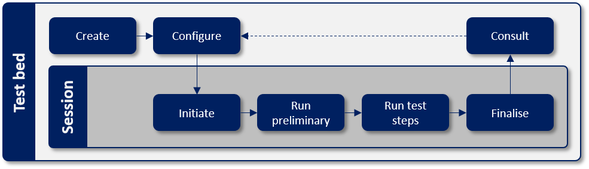

.. _introduction:

Introduction
============

The purpose of the current documentation is to make it possible for you to understand and create test suites
using the GITB TDL. The approach followed herein is to document the available possibilities providing easy to 
follow examples but also to note where appropriate certain considerations on the use of TDL in the GITB test bed
software.

.. index:: GITB
.. index:: TDL

What is the GITB TDL?
---------------------

The `GITB project`_ represents a CEN standardisation initiative funded by the European Commission’s DG GROW 
to provide the specifications for a generic interoperability test bed and their implementation in the form 
of the GITB test bed software. The focus of these specifications and software is not any kind of testing 
(e.g. performance, regression, penetration) but rather conformance and interoperability testing. Simply
put, *conformance testing* verifies that the requirements of a given specification are met, whereas
*interoperability testing* comes as a second step to verify that two or more parties can interact as expected.
Furthermore, the focus here is on technical specifications related to e.g. messaging protocols or content,
whereas the parties previously mentioned would typically be software components.

A key element of the GITB specifications is the **GITB Test Description Language** (GITB TDL) that is used to 
express how individual tests are defined in terms of involved actors and foreseen steps. The goal for GITB TDL
is to provide test descriptions that are executable, i.e. ready to be processed by a testing engine capable of
understanding GITB TDL, but also human readable. To achieve this, GITB TDL is based on XML, defining specific 
elements to match its foreseen testing constructs. 

.. _GITB project: http://www.cen.eu/work/areas/ict/ebusiness/pages/ws-gitb.aspx

Where is it used?
~~~~~~~~~~~~~~~~~

The short answer is that GITB TDL is used in the GITB test bed software to define and run tests.

To be more complete however, GITB TDL is not tied to the GITB software per se but can be processed by any test bed
implementation that conforms to the GITB specifications. In fact, the GITB specification foresees the concept
of TDL compliance and splits this in *GITB compliant TDL processors* and *GITB TDL compliant producers*. Simply
put, a TDL processor is any software that can read GITB TDL content and understand it, typically being a
test bed implementation that can read and execute GITB TDL test cases when requested (without necessarily conforming
to other elements of the overall GITB specification). On the other hand, a TDL producer is software that can 
output TDL content, in which case we would typically be referring to test case editors or converter tools from
other test case representations. Finally, consider that compliance to GITB TDL is not necessarily an "all-or-nothing"
statement; compliance can be partial by supporting only a limited set of constructs. To support this last point, GITB
TDL concepts and constructs are formalised using a `published taxonomy`_ that can be referenced to understand the TDL 
constructs that are used (within a test case) or supported (by a test bed).

One of the goals of GITB TDL is also to help reuse existing work by ideally sharing test cases between test bed 
implementations. To this effect the `GITB Test Registry and Repository (TRR)`_ aims to act as a reuse portal for 
GITB TDL test cases by facilitating their discovery and listing their expected and used constructs.

.. _published taxonomy: http://data.europa.eu/itw
.. _GITB Test Registry and Repository (TRR): https://joinup.ec.europa.eu/collection/gitb-trr

.. index:: Interoperability Test Bed Action

How is it maintained?
~~~~~~~~~~~~~~~~~~~~~

Following the initial work from the CEN GITB workgroup, the maintenance and evolution of GITB TDL has been taken over 
by the European Commission, specifically the `Interoperability Test Bed Team`_ of DIGIT D.2. DIGIT D.2 foresees the 
maintenance of the GITB software and specification based on the needs of the testing community and carries out evolutive
maintenance with regular releases. Regarding GITB TDL in particular, introduced changes are always done in a backwards-compatible manner, adding 
capabilities rather than changing existing ones. Releases of GITB TDL and its version numbers currently follow the 
versioning of the GITB software.

.. _Interoperability Test Bed Team: https://joinup.ec.europa.eu/solution/interoperability-test-bed/about

Core concepts
-------------

Before diving into GITB TDL it is important to be aware of certain core concepts.

.. index:: Test case

Test case
~~~~~~~~~

A **test case** represents a set of steps and assertions that form a cohesive scenario for testing purposes. 
These are captured as a single XML file authored using GITB TDL constructs.

.. index:: Test suite

Test suite
~~~~~~~~~~

A **test suite** is used to group together related test cases into a cohesive set. A test suite can include
metadata such a name and description that provide useful context to understand the purpose of its contained
tests. A test suite is expressed as an XML file and is bundled in a ZIP archive along with its contained 
test cases and the resources they use.

.. index:: Test session

Test session
~~~~~~~~~~~~

A **test session** represents a single execution of a test case. It typically involves the provision of
configuration from the user starting the test, goes through the steps the test case foresees and eventually
completes providing the session's overall result.

.. index:: Test session context
.. index:: Session context

Test session context
~~~~~~~~~~~~~~~~~~~~

The **test session context** can be considered a persistent store specific to a given test session that is used to record
values. These values can either be configuration parameters provided before the test session starts, configuration parameters
generated during the test session's initiation, or values that are added dynamically during the session as a result of the 
ongoing test steps. The test session context is very important in that it gives a level of control above individual test 
steps that allow the testing of complete conversations. In addition, its ability to store and lookup arbitrary content dynamically
makes it possible to implement complex flows and control logic.

The test session context can be viewed as a map or keys to values, where each key is a string identifier and the value can be 
any type supported by GITB, including additional nested maps.

.. index:: Actor
.. index:: SUT (System Under Test)

Actor
~~~~~

An **actor**, from the perspective of GITB, represents a party involved in the overall process that the test cases
aim to test. What exactly is an actor depends fully on the tests or the specification they relate to. Here are
some examples:

* A specification that foresees sending a message from one party to another could define a "Sender" and "Receiver" 
  actor to represent the involved parties.
* A solution that foresees a central EU portal exchanging information with national endpoints could define the "Portal" 
  and "National endpoint" as actors.
* A content specification (e.g. XML-based) for which we simply want to allow users to upload samples for validation 
  could define a "User" actor to represent this role in test cases.

Once actors are defined they play an important role in the testing process as follows:

* They define properties relevant to the testing (think of them as actor-specific configuration elements).
* Each test case foresees that actors are either simulated by the test bed or are the focus of the test. In the latter case
  they are referred to as having a role of **SUT** (System Under Test).

.. index:: Messaging handlers
.. _introduction-concepts-messaging-handlers:

Messaging handlers
~~~~~~~~~~~~~~~~~~

**Messaging handlers** are embedded or external components whose purpose is to allow 
messaging for actors, defining how these receive and send messages. How this actually takes place can be
completely arbitrary and is not tied to a specific protocol. What is important is that the test bed can signal to the handler that
it needs to send data or similarly signal that it is waiting to receive data. In this latter case, the handler notifies the 
test bed by means of a call-back with the relevant received payload.

To enable interaction with the test bed, messaging handlers implement the `GITB messaging service API`_. This interface defines the 
methods needed to signal events between the test bed and the handler and provide relevant input and output. Implementations can 
either be embedded test bed components or external web service endpoints. Input to a handler is provided using the test session's
configuration and context whereas the output of messaging is recorded in the session context for subsequent use.

Having the actual implementation of sending and receiving decoupled in dedicated components means that the test bed can be extended 
to handle virtually any needed protocol, requiring only that an appropriate handler exists. If for example the test bed needs to send 
and receive email, it does not need to support e.g. SMTP natively, it just needs access to a handler that can send and receive emails on its behalf.

.. note::
    **Messaging handlers as adapters:** Messaging handlers are used when messaging to and from simulated actors but can also
    act as adapters over existing software, translating GITB-specific calls to the actual processes that carry out messaging.

.. _GITB messaging service API: https://www.itb.ec.europa.eu/specs/latest/gitb_ms.wsdl

.. index:: Validation handlers
.. _introduction-concepts-validation-handlers:

Validation handlers
~~~~~~~~~~~~~~~~~~~

**Validation handlers** are similar in concept to messaging handlers but much simpler. Their purpose is limited to validating content and 
returning a report with the result. Validation is a fully decoupled process in that the content being validated, as well as any other parameters, 
are provided by the test bed as input without needing to be aware of how validation actually takes place. The result of a validation handler is 
recorded in the test session context for subsequent use in the test case.

Validation handlers implement the `GITB validation service API`_ that defines the operations needed by the test bed to request
validation for specific input and receive the results. Implementations can be either embedded components or external web service endpoints.

.. _GITB validation service API: https://www.itb.ec.europa.eu/specs/latest/gitb_vs.wsdl

.. index:: Processing handlers
.. _introduction-concepts-processing-handlers:

Processing handlers
~~~~~~~~~~~~~~~~~~~

**Processing handlers** are extensions to the test bed's capabilities to undertake actions that it does not natively support. The 
purpose of a processing handler is to receive a set of input parameters that it can process and produce a 
set of output values. These output values are stored in the test session context for subsequent use. 

Processing handlers implement the `GITB processing service API`_ that defines the operations needed by the test bed to request
processing for specific input and receive the results. Implementations can be either embedded components or external web service endpoints.

.. _GITB processing service API: https://www.itb.ec.europa.eu/specs/latest/gitb_ps.wsdl

The lifecycle of a test session
-------------------------------

The following diagram illustrates the steps involved in creating and using a test case. These steps occur within a test bed as part of overall
test management before and after the test's execution and also during the test session itself.

  The test session lifecycle

Step 1: Create
~~~~~~~~~~~~~~

Before we can start testing we need to create a test suite and at least one contained test case. The test suite will define actors matching the
specification's requirements and the test cases will each define one actor from the ones configured as the SUT. Other actors will be defined 
as being simulated.

Step 2: Configure
~~~~~~~~~~~~~~~~~

The actor that is identified as the SUT may have one or more optional or required configuration parameters that need to be provided. These are 
verified before test session execution to ensure that all required parameters are defined. Configuration parameters are provided by administrators
of the organisation that is engaged in testing.

Step 3: Initiate
~~~~~~~~~~~~~~~~

During this step a new test session is created and the messaging handlers of any simulated actors present are notified to prepare. This is done 
by calling the simulated actors' messaging handlers passing the session information and also the configuration parameters of the SUT. Apart from 
preparing the messaging handlers for the upcoming session this notification may also result in specific configuration provided from the messaging 
handlers to the SUT (e.g. a dynamically created address to send messages to).

Step 4: Run preliminary
~~~~~~~~~~~~~~~~~~~~~~~

With all actors configured, this is the phase where notifications may be presented to the user to prepare for the upcoming test.
These notifications can either be instructions to follow or requests for data to be provided before the test session starts.

Step 5: Run test steps
~~~~~~~~~~~~~~~~~~~~~~

During this phase the test session proceeds to execute the steps defined in the test case's description. Any supported set of steps can take place
resulting in a test session context that is populated with variables and referenced according to the implemented test logic. The test steps may involve automatic 
processing and validation, interaction with messaging handlers to send and receive messages, user input requests, and any control logic constructs
that are needed to correctly express the expected flow. The test session eventually completes, resulting in one of three outcomes:

* **Success:** If all test steps are completed successfully.
* **Failure:** If one of the test steps failed.
* **Undefined:** If the session was terminated before completion.

Step 6: Finalise
~~~~~~~~~~~~~~~~

Upon finalisation the test bed cleans up the state relevant to the test session and also notifies external handler implementations to consider the 
session as closed.

Step 7: Consult
~~~~~~~~~~~~~~~

The results of the test session can be consulted either immediately following completion or by looking up the results in the organisation's test session
history. A test session records its output per step that can be used to produce detailed test step reports or an overview report for the complete
test session.

.. _introduction_spec_links:

Specification links
-------------------

The following table provides the links to access the latest version of the GITB specifications. These include XSDs defining the GITB
TDL constructs but also related specifications such as the WSDLs for messaging, processing and validation services.

.. csv-table::
  :header: "Specification", "Description", "Link"

  GITB core elements, The XSD defining core elements used in other GITB XSDs, https://www.itb.ec.europa.eu/specs/latest/gitb_core.xsd
  GITB test description language (TDL), The XSD defining the types used when defining TDL test suites and test cases, https://www.itb.ec.europa.eu/specs/latest/gitb_tdl.xsd
  GITB test presentation language (TPL), The XSD defining types used to report on the status of a test session, https://www.itb.ec.europa.eu/specs/latest/gitb_tpl.xsd
  GITB test reporting language (TRL), The XSD defining the types used to report step output, https://www.itb.ec.europa.eu/specs/latest/gitb_tr.xsd
  GITB messaging service API, The WSDL defining messaging service operations, https://www.itb.ec.europa.eu/specs/latest/gitb_ms.wsdl
  GITB messaging service types, The XSD defining the messaging service message types, https://www.itb.ec.europa.eu/specs/latest/gitb_ms.xsd
  GITB validation service API, The WSDL defining validation service operations, https://www.itb.ec.europa.eu/specs/latest/gitb_vs.wsdl
  GITB validation service types, The XSD defining the validation service message types, https://www.itb.ec.europa.eu/specs/latest/gitb_vs.xsd
  GITB processing service API, The WSDL defining processing service operations, https://www.itb.ec.europa.eu/specs/latest/gitb_ps.wsdl
  GITB processing service types, The XSD defining the processing service message types, https://www.itb.ec.europa.eu/specs/latest/gitb_ps.xsd
  GITB test bed service API, The WSDL defining test bed service operations, https://www.itb.ec.europa.eu/specs/latest/gitb_tbs.wsdl
  GITB test bed service types, The XSD defining the test bed service message types, https://www.itb.ec.europa.eu/specs/latest/gitb_tbs.xsd

The complete set of latest GITB specifications can be downloaded from https://www.itb.ec.europa.eu/specs/latest/gitb_all.zip.

The final GITB workgroup report can be downloaded here [:download:`CEN_WS_GITB3_CWA_Final.pdf`].